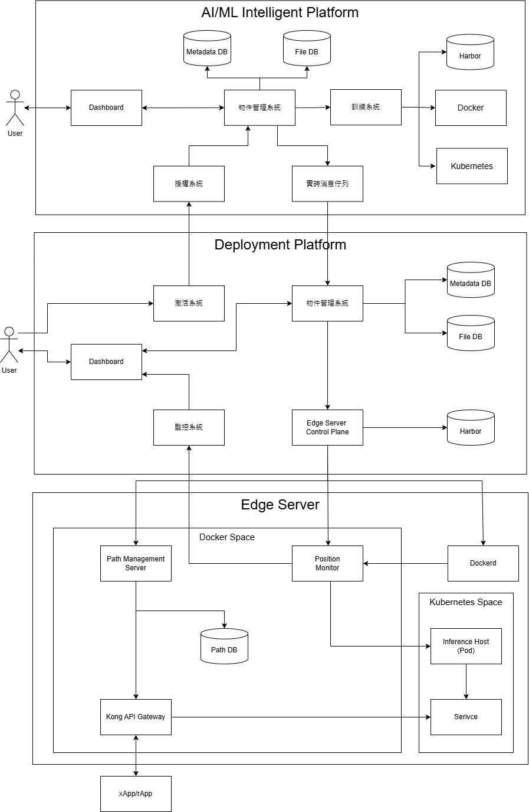
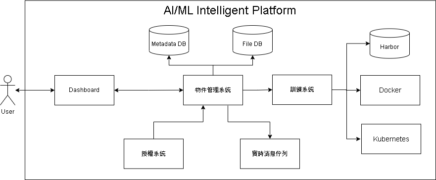
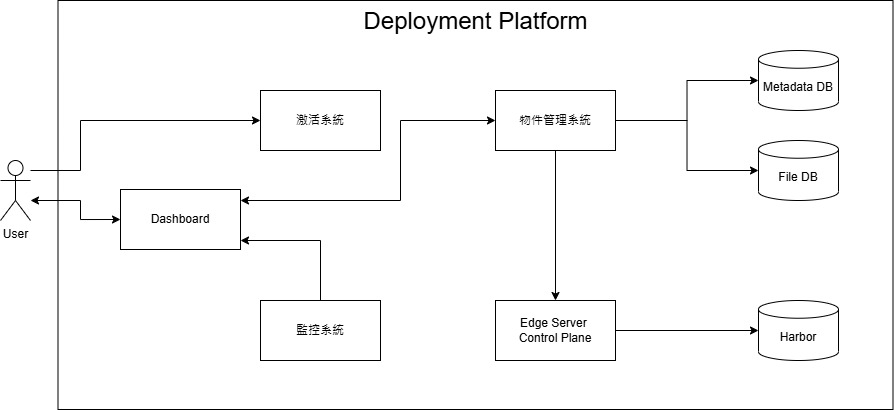
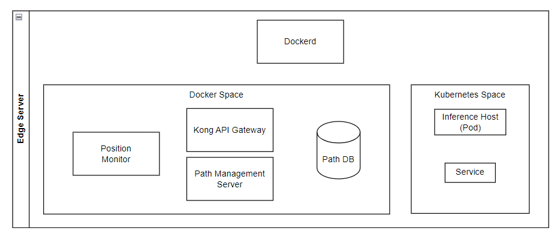

# 平台整體架構圖

這是一個以 **AI/ML智能平台** 為核心的架構圖，包含三個主要的層級：
* AI/ML Intelligent Platform：用於模型訓練與發佈、專案管理及資料集管理。
* Deployment Platform：將訓練完成的模型部屬到邊緣伺服器。
* Edge Server：執行部屬的模型，並提供推論服務。

---

# AI/ML Intelligent Platform

* **資料與模型管理**：
  * 使用者可透過**Dashboard**管理專案、資料集及模型資訊，並透過**檔案管理系統**將資料儲存到**File DB**和**Metadata DB**。
  * 專案內可以創建應用(Application)，應用下包含管線(Pipeline)或資料集，用來處理資料或訓練模型。
* **模型訓練與發佈**：
  * 管線執行後，模型由**訓練系統**完成訓練，並將訓練好的模型打包為Docker Image，推送至Harbor(私有容器倉庫)。
  * 訓練完成的模型可以透過Dahboard發布給Deployment Platform，用於進一步的部屬操作。

# 部屬平台（Deployment Platform）

---

* **部屬管理**:
  * 模型從Harbor抓取後，可根據配置將模型分發到邊緣伺服器。
* **協調與監控**:
  * Edge Serve Control Plane負責與邊緣伺服器協調部屬，**監控系統**可即時追蹤部屬進度與模型運行情況，確保部屬穩定性。
* **資料支持**:
  * Metadata DB 和 File DB 提供模型的資訊與檔案支持，確保部屬完整性與一致性。

---

# 邊緣伺服器（Edge Server）

* **執行與推論服務**:
  * 邊緣伺服器抓取到模型映像檔後，透過Kubernetes Space啟動。
  * Path Management Server 和 Position Monitor 提供運行環境的路徑配置及狀態監控。
  * 邊緣伺服器執行推論後，通過Kong API Gateway 提供即時服務給應用程式(xApp/rApp)