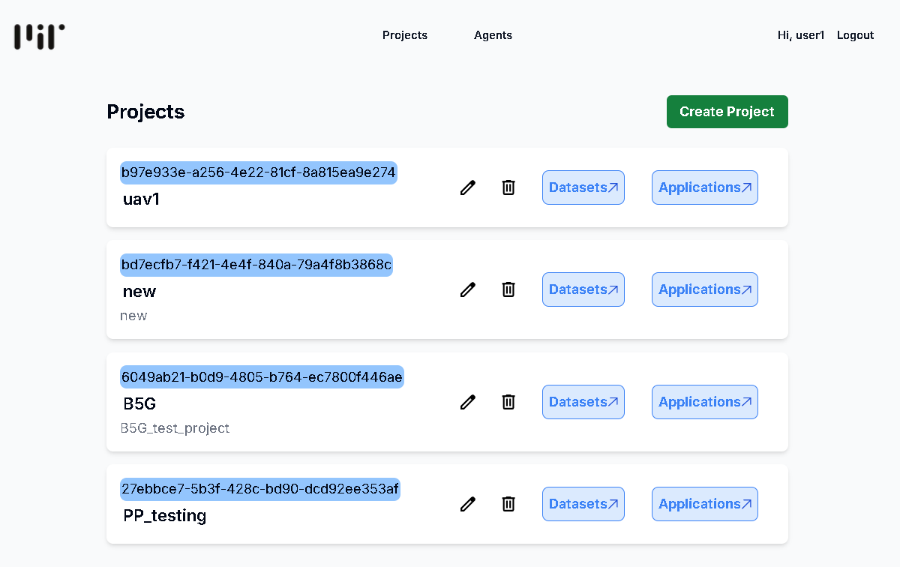
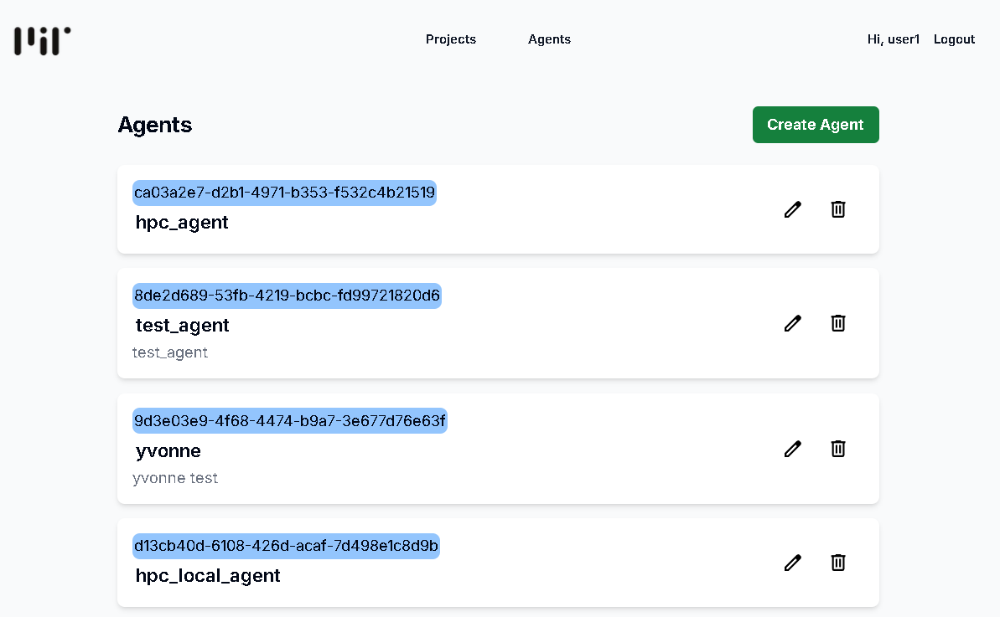
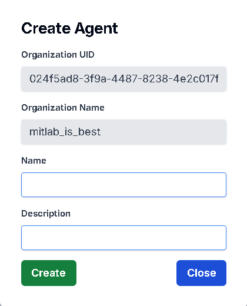
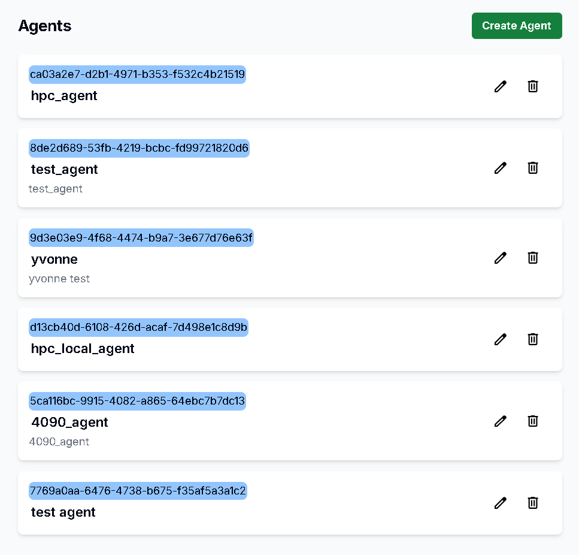
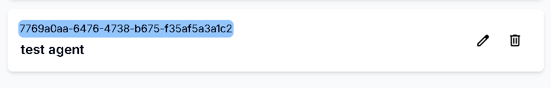
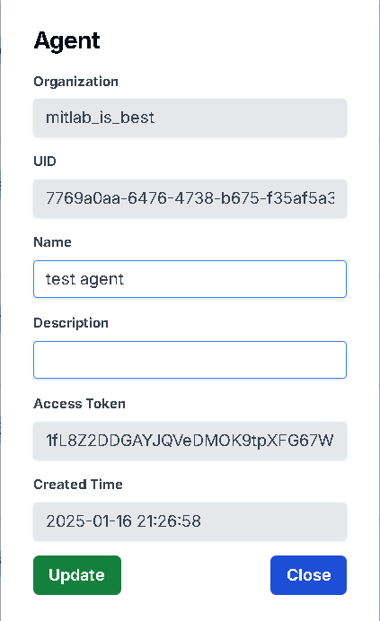
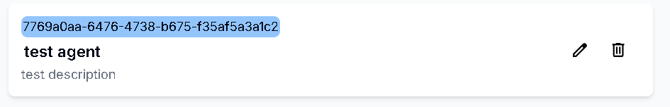

# 查看所有Agent

## 用途

查看你的 Organization 內的所有 Agent 資訊

## 操作步驟

1. 點擊上方Agents，即可顯示所有Agent資訊
    
    

# 新增Agent

## 用途

為你的 Agent 創建資訊

## 操作步驟

    
1. 點擊右上角的Create Agent
    
    
    
2. 輸入Agent名稱及描述後按下Create按鈕
    
    
    
3. Agent新增成功
    
    

# 更新Agent

## 用途

更新你的 Agent 資訊

## 操作步驟

1. 點擊右方的Edit圖示
   
    

2. 輸入更新的Agent資訊後，按下Update按鈕
   
    

3. Agent更新成功
   
    

# 刪除Agent

## 用途

刪除已不需要的 Agent 資訊

## 操作步驟

1. 點擊右方的Delete圖示
     
    

2. 按下Delete按鈕即可刪除成功

    

