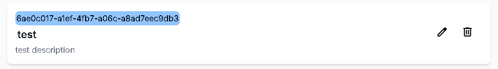
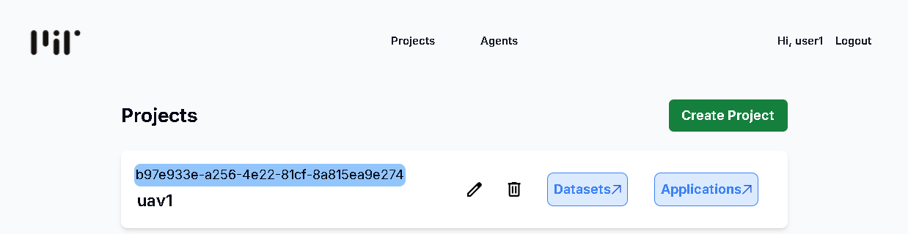
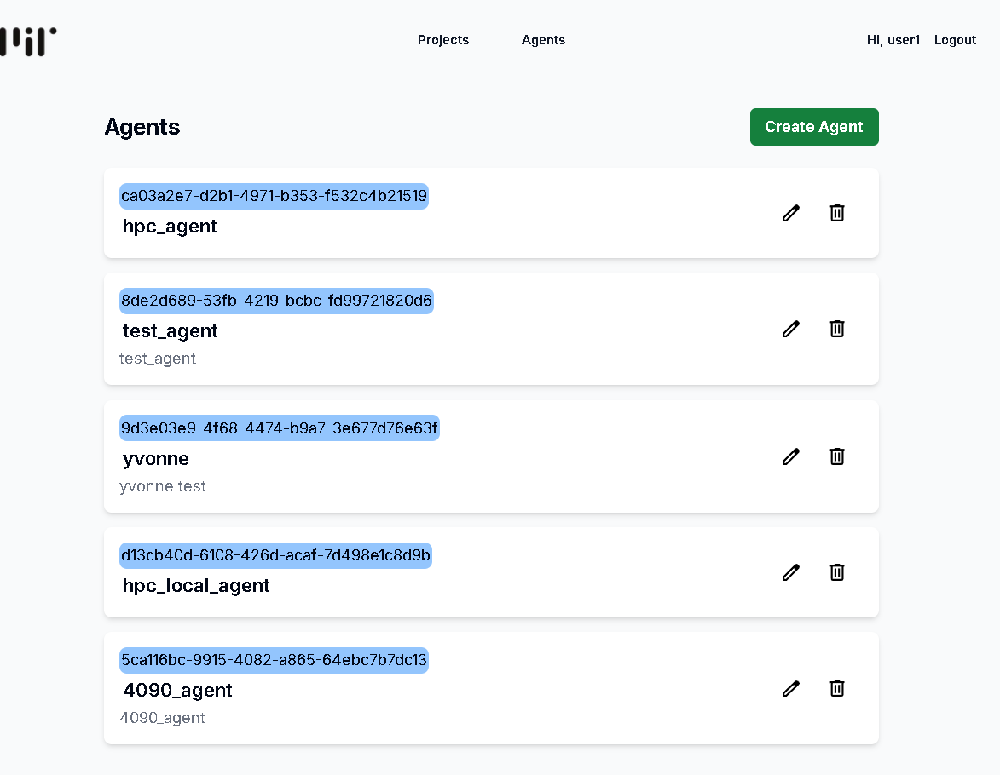
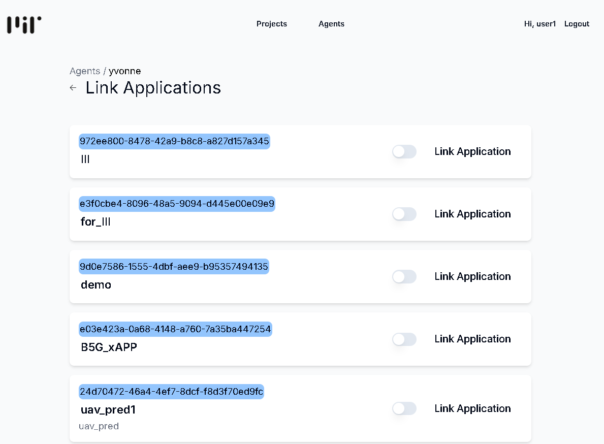

# 查看所有Application

## 用途

查看你的 Project 內的所有 Application 資訊

## 操作步驟

1. 點擊Project上的Application按鈕進入Application頁面，即可顯示所有Application
    
    

# 新增Application

## 用途

為你的 Application 創建資訊

## 操作步驟

    
1. 點擊右上角的Create Application按鈕
    
    
    
2. 輸入Application名稱及描述後按下Create按鈕
    
    
    
3. Application新增成功
    
    

# 更新Application

## 用途

更新你的 Application 資訊

## 操作步驟

1. 點擊右方的Edit圖示
   
    

2. 輸入更新的Application資訊後，按下Update按鈕
   
    

3. Application更新成功
   
    

# 刪除Application

## 用途

刪除已不需要的 Application 資訊

## 操作步驟

1. 點擊右方的Delete圖示
     
    

2. 按下Delete按鈕即可刪除成功

    

# 發布Application給代理端

## 用途

將所需的Application發布給Agent端，讓Agent端能看到Application內的資訊

## 操作步驟

1. 點擊上方的Agents
   
    

2. 點擊要發布Application的Agent

    

3. 選擇要發布的Application，點擊Link Application後，按下Confirm

    

4. 成功發布Application給所需的代理端

    

