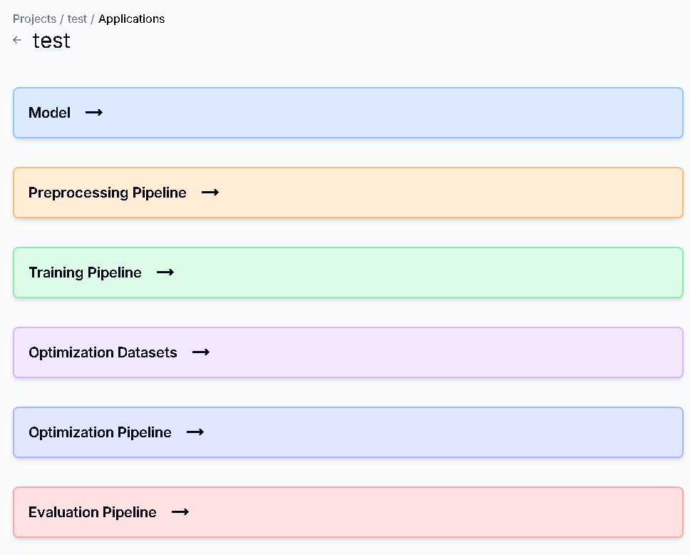

# 查看所有Optimization Dataset

## 用途

查看你的 Application 內的所有 Dataset 資訊

## 操作步驟

1. 進入Application  Dashboard頁面後，點擊Optimization Datasets，即可顯示所有Dataset
    
    

# 新增Optimization Dataset

## 用途

放入你想要優化的Original Dataset或是已優化完成的Optimizarion Dataset

## 操作步驟

### Original Dataset

1. 進入Application  Dashboard頁面後，點擊Optimization Datasets
    
    
    
2. 點擊Upload Original Dataset按鈕
    
    
    
3. 輸入Dataset名稱及描述後，點擊Select File按鈕，即可上傳你的Dataset壓縮檔(支援.zip)，上傳完後按下Create按鈕
    
    
    
4. Original Dataset新增成功
    
    
    

### Optimization Dataset

1. 點擊Original Datasets右側的Optimization Datasets按鈕，並按下Upload Optimization Dataset 按鈕
    
    
    
2. 輸入Dataset名稱及描述後，點擊Select File按鈕，即可上傳你的Dataset壓縮檔(支援.zip)，上傳完後按下Create按鈕
    
    
    
3. Optimization Dataset 新增成功
    
    

# 更新Original/Optimization Dataset

## 用途

更新你的 Original/Optimization Dataset 資訊

## 操作步驟

1. 點擊右方的Edit圖示
    
    

2. 輸入更新的Dataset資訊，或是按下Select File即可重新上傳檔案。完成後按下Update按鈕
    
    

3. Dataset更新成功
    
    

# 下載Original/Optimization Dataset

## 用途

確認上傳的 Original/Optimization Dataset 檔案正確，以及避免檔案消失

## 操作步驟

1. 點擊右方的Download圖示，在下載紀錄按下保留檔案，即可下載成功
    
    

# 搜尋Original/Optimization Dataset

## 用途

找尋你所需的 Original/Optimization Dataset 資訊

## 操作步驟

1. 在Search框中輸入你要尋找的Dataset名稱後按下放大鏡圖示

    

2. Dataset搜尋成功

    

# 刪除Original/Optimization Dataset

## 用途

刪除已不需要的 Original/Optimization Datasset 資訊

## 操作步驟

1. 點擊右方的Delete圖示
    
    

2. 按下Delete按鈕即可刪除成功
    
    