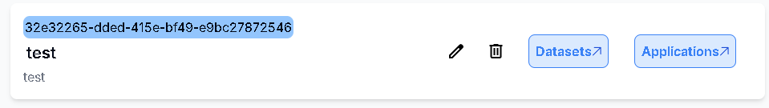

# 新增Application

## 用途

為每一個應用創建一個Application

## 操作步驟

1. 點擊Project上的Application按鈕進入Application頁面
    
    
    
2. 點擊右上角的Create Application 按鈕
    
    
    
3. 輸入Application名稱及描述後按下Create按鈕
    
    
    
4. Application新增成功
    
    