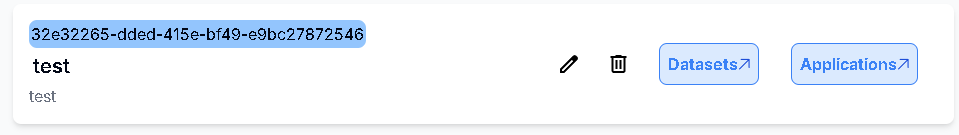

# 新增Model

## 用途

為你已經訓練好的Model建立資訊

## 操作步驟

1. 點擊Project上的Application按鈕進入Application頁面
    
    
    
2. 點擊你的Application
    
    
    
3. 進入Application Dashboard頁面後，點擊Model
    
    
    
4. 點擊Upload Model按鈕
    
    
    
5. 輸入Model名稱、’描述及輸入/出格式後，點擊Select File按鈕，即可上傳你的Model壓縮檔(支援.zip)，上傳完後按下Create按鈕
    
    
    
6. Model創建成功
    
    