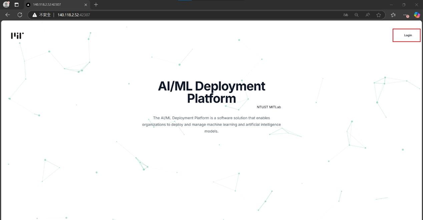
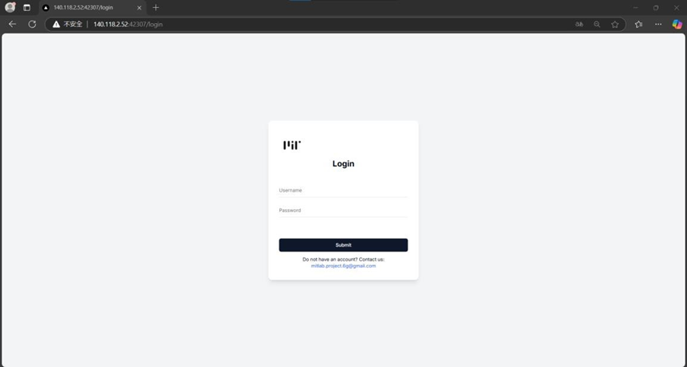
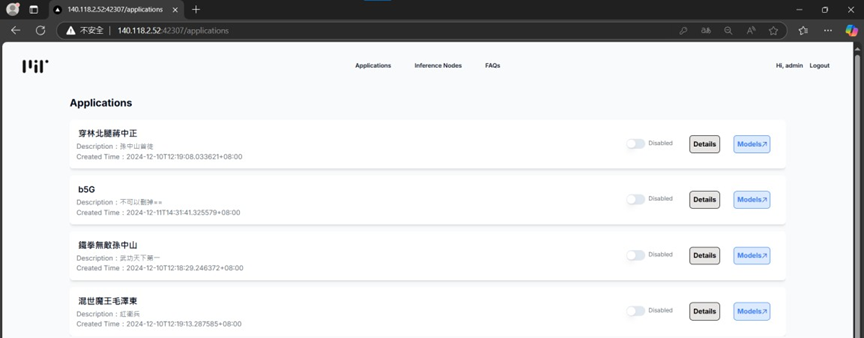
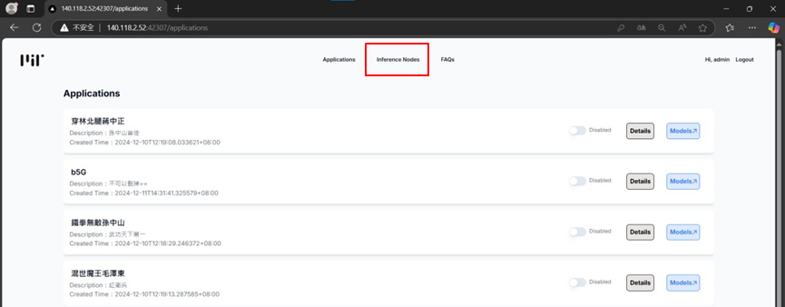
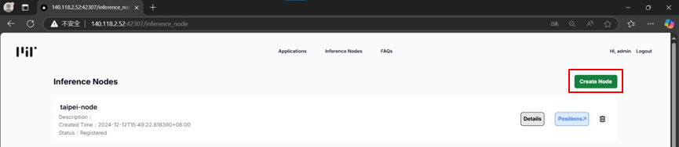
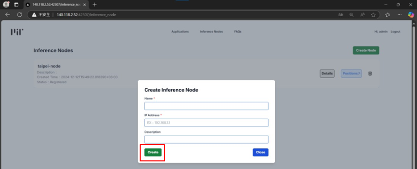
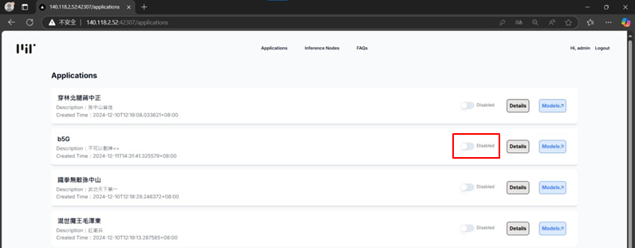
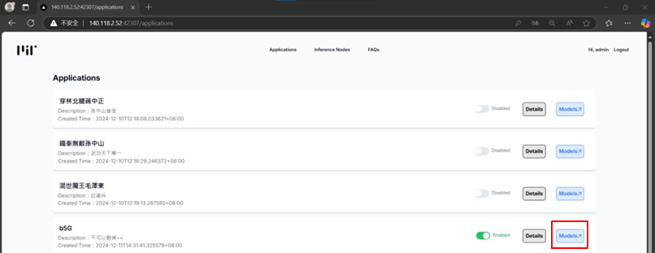
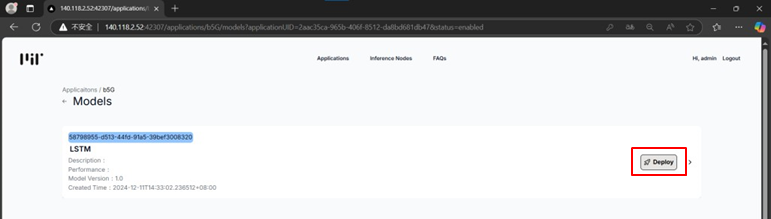
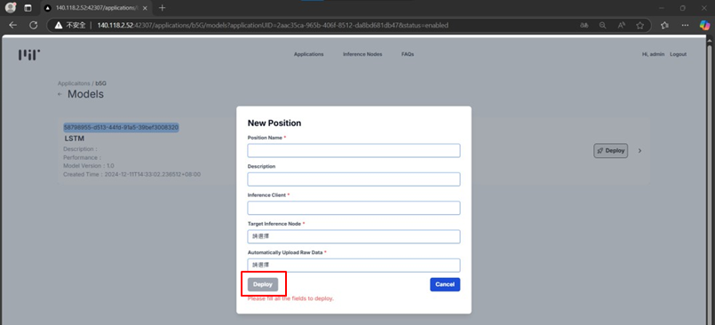

# 部屬position流程
此頁面提供用戶從登入到部屬 Position 的完整指引，操作步驟如下：

1.  首頁，點擊左上角Login進行登入
   
   

2.  輸入帳號密碼進行登入
   
   

3.  登入後，即可查看所有中央層(AI/ML Intelligent Platform)發布的applications
   
   

4.  至inference node頁面，新增欲部屬position的node
   
   
   
   

5.  開啟欲部屬的application部屬功能
   
   
   

6.  點擊欲部屬的app，即可看到該app的models，點擊欲部屬Model的deploy按鈕
   
   

7.  填寫position 元數據(metadata)並部屬
   
   