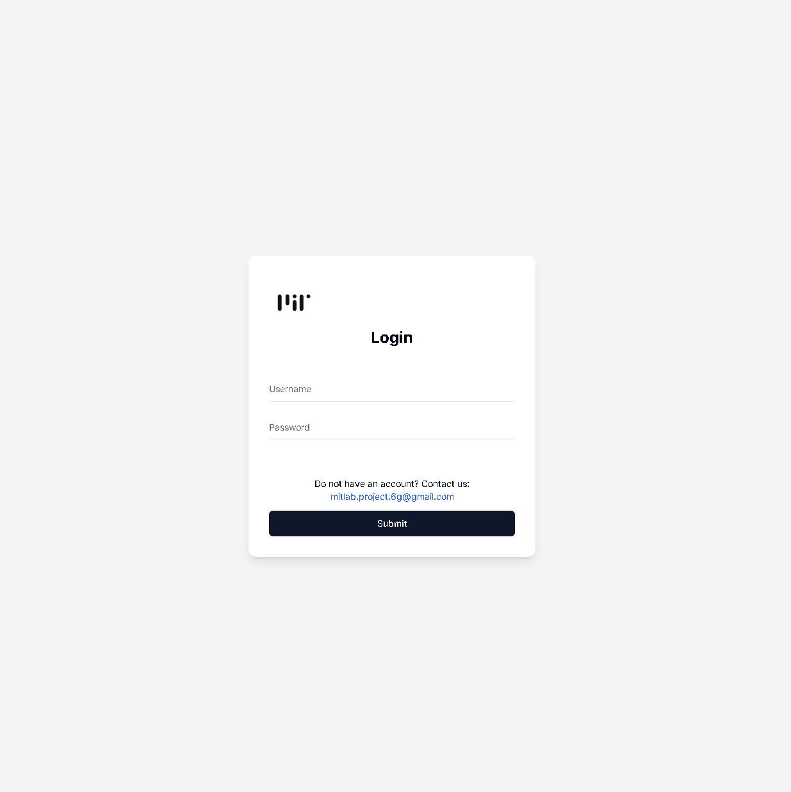
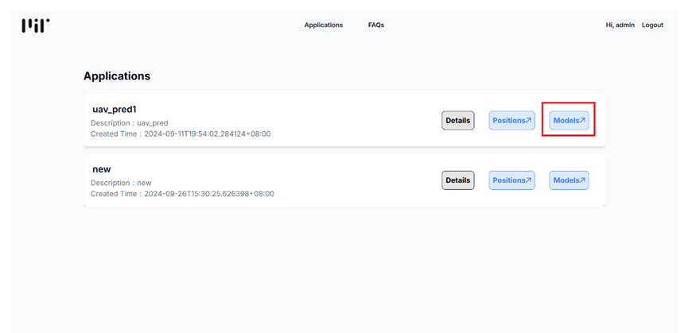

# 部屬position流程
此頁面提供用戶從登入到部屬 Position 的完整指引，操作步驟如下：

1.  首頁，點擊左上角Login進行登入
   
   

2.  輸入帳號密碼進行登入
   
   

3.  登入後，即可查看所有中央層(AI/ML Intelligent Platform)發布的applications，點選欲部屬的application中的Model按鈕
   
   

4.  選擇該application中，欲部屬model中的deploy按鈕
   
   

5.  填寫position metadata 並部屬
   
   