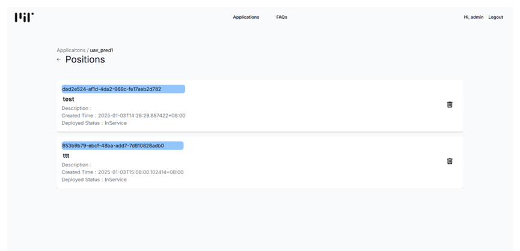

此頁面提供從應用層到節點層再到位置層的多層次管理，幫助使用者清楚了解代理層的資源分配與使用情況，並能快速進行調整與監控操作。
以下是各個介面的功能與用途：

# Applications 頁面

1. 查看**Postion Detail**，介面如下
   
   

2. 查看此**Application**下的所有**Position**，介面如下
   
   

3. 查看此**Position**下所有**Model**，介面如下
   
   

4. 登出

---

# Position 頁面

1. 回到Application介面
2. 刪除此Position
   
---

# Models 頁面

1. 回到Application介面
2. 部屬此Model
