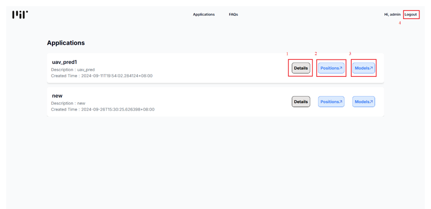

此頁面提供從應用層到節點層再到位置層的多層次管理，幫助使用者清楚了解代理層的資源分配與使用情況，並能快速進行調整與監控操作。
以下是各個介面的功能與用途：

# Applications 頁面

1. 進到Application頁面後，可以瀏覽所有應用程式，方便使用者快速了解代理層的應用配置。
2. 查看應用程式下的 **Inference Node**（推論節點），掌握節點詳細內容。
   
   

3. 透過啟用/停用按鈕，快速操作應用程式的啟動或暫停。
4. 查看 **App Metadata**，例如應用名稱、Token、描述等詳細元數據。
   
   

5. 瀏覽該應用所屬的模型，清楚了解其內部的模型結構與部署情況。
   
   

---

# Inference node 頁面

1.  新增新的推論節點，建立新的資源實例。
   
   

2.  查看指定節點的 **Metadata**，包含節點的配置信息。
   
    

3.  瀏覽節點下的所有 **Position**（位置），掌握節點內部的詳細狀況。
   
    

4.  刪除不需要的節點，釋放資源。
   
---

# Positions 頁面

1.  點擊進入指定 **Position** 的監控介面，查看運行情況。 
   
   

2.  查看該位置的 **CPU** 與 **Memory 用量**，了解資源消耗狀況。
3.  刪除特定位置，調整節點內的配置。
   
---

# 監控Position頁面

1.  調整推論主機數量（減少/增加主機數量），控制運算資源的分配。
2.  更換此位置部署的模型，靈活配置模型版本。
3.  手動上傳 **Raw Data**（原始數據）至中央層，支持後續的數據處理。
4.  刷新頁面，獲取最新的執行數據。
5.  查看 **CPU** 與 **Memory 用量**，監控資源消耗。
6.  查看 **Closed Loop 時間**，評估位置處理的迴路延遲。
