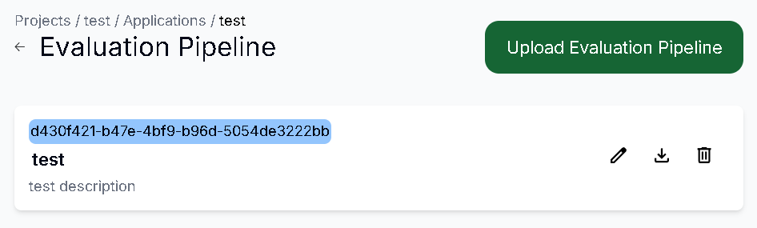
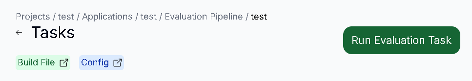
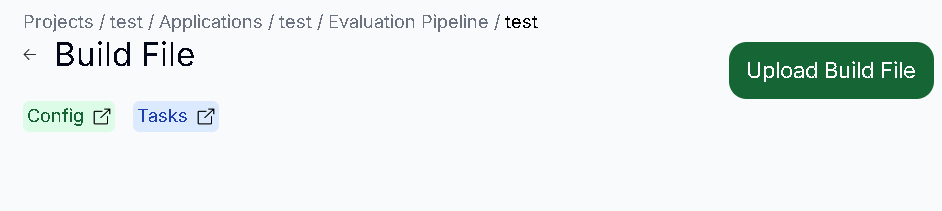
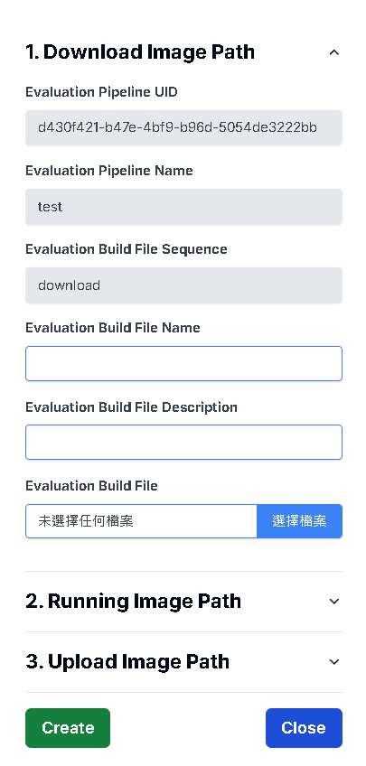
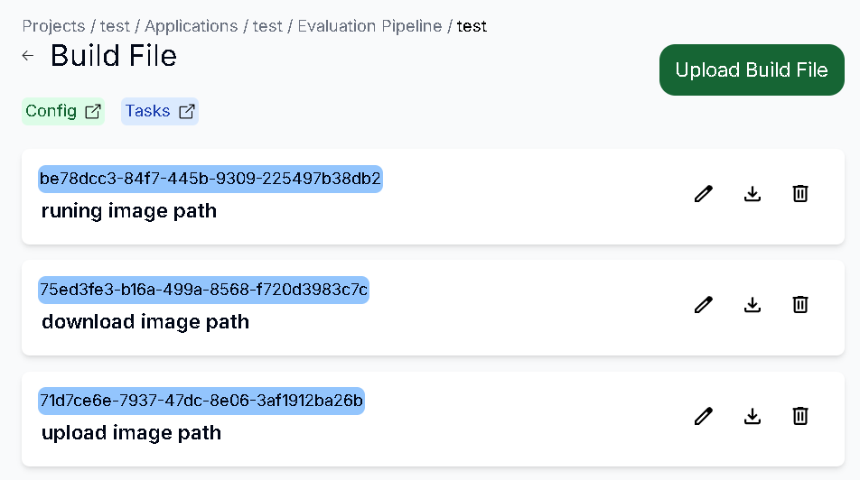
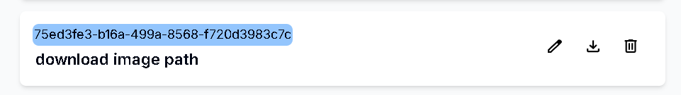
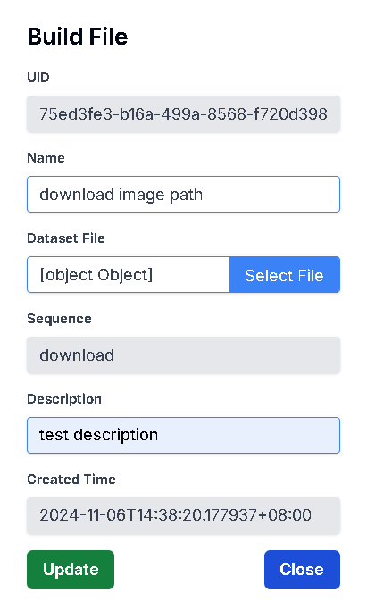
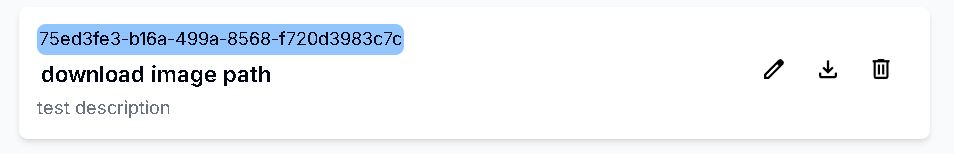
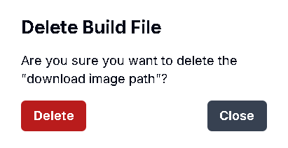

# 查看所有Evaluation Image

## 用途

查看你的 Evaluation Pipeline 內的所有 Image 資訊

## 操作步驟

1. 進入Evaluation Pipeline頁面後，點擊Pipeline
    
    
    
2. 點擊右側的Build File按鈕跳轉到Build File頁面，即可顯示所有Image
    
    

# 新增Evaluation Image

## 用途

為你的 Evaluation Image 創建資訊

## 操作步驟
    
1. 按下Upload Build File按鈕
    
    
    
2. 輸入你的 Optimization Image 資訊後，點擊Select File按鈕，即可上傳你的Image檔案，上傳完成後按下 Create按鈕(請注意，總共有三個Image需要上傳)
    
    

3. Evaluation Image 創建成功

    

# 更新Evaluation Image

## 用途

更新你的 Evaluation Image 資訊

## 操作步驟

1. 點擊右方的Edit圖示
    
    
    
2. 輸入更新的Image資訊，或是按下Select File即可重新上傳檔案，完成後按下Update按鈕
    
    
    
3. Image更新成功
    
    

# 下載Evaluation Image

## 用途

確認上傳的 Evaluation Image 檔案正確，以及避免檔案消失

## 操作步驟

1. 點擊右方的Download圖示，在下載紀錄按下保留檔案，即可下載成功
    
    

# 刪除Evaluation Image

## 用途

刪除已不需要的 Evaluation Image 資訊

## 操作步驟

1. 點擊右方的Delete圖示
    
    

2. 按下Delete按鈕即可刪除成功
    
    