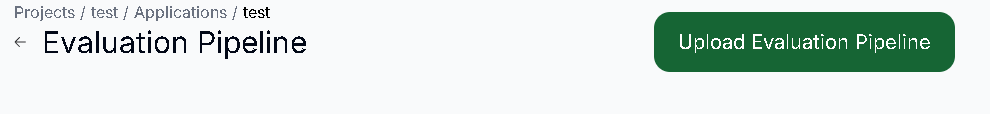
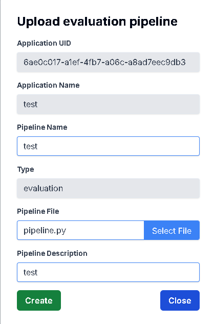
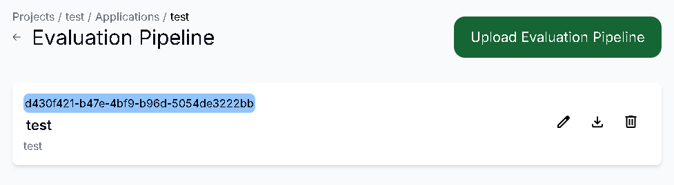
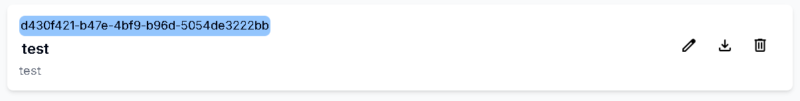
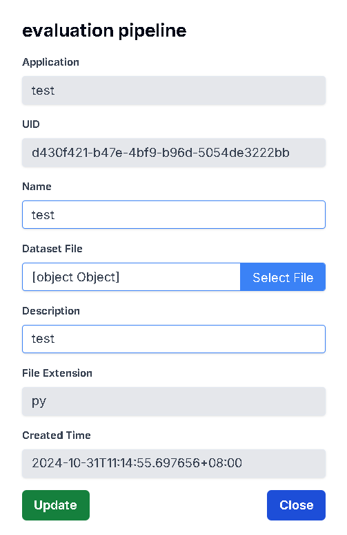
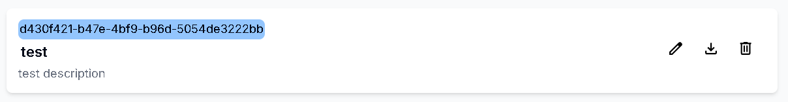
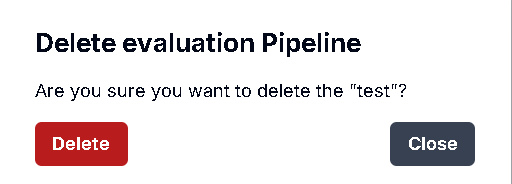

# 查看所有Evaluation Pipeline

## 用途

查看你的 Application 內的所有 Evaluation Pipeline 資訊

## 操作步驟

1. 進入Application  Dashboard頁面後，點擊Evaluation Pipeline，即可顯示所有Evaluation Pipeline
    
    

# 新增Evaluation Pipeline

## 用途

為你的 Evaluation Pipeline 創建資訊

## 操作步驟
    
1. 點擊Upload Evaluation Pipeline按鈕
    
    
    
2. 輸入Evaluation Pipeline資訊後，點擊Select File按鈕，即可上傳你的Pipeline檔案，上傳完後按下Create按鈕
    
    
    
3. Evaluation Pipeline創建成功
    
    

# 更新Evaluation Pipeline

## 用途

更新你的 Evaluation Dataset 資訊

## 操作步驟

1. 點擊右方的Edit圖示
    
    

2. 輸入更新的Pipeline資訊，或是按下Select File即可重新上傳檔案。完成後按下Update按鈕
    
    

3. Pipeline更新成功
    
    

# 下載Evaluation Pipeline

## 用途

確認上傳的 Evaluation Pipeline 檔案正確，以及避免檔案消失

## 操作步驟

1. 點擊右方的Download圖示，在下載紀錄按下保留檔案，即可下載成功
    
    

# 刪除Evaluation Pipeline

## 用途

刪除已不需要的 Evaluation Pipeline 資訊

## 操作步驟

1. 點擊右方的Delete圖示
    
    

2. 按下Delete按鈕即可刪除成功
    
    