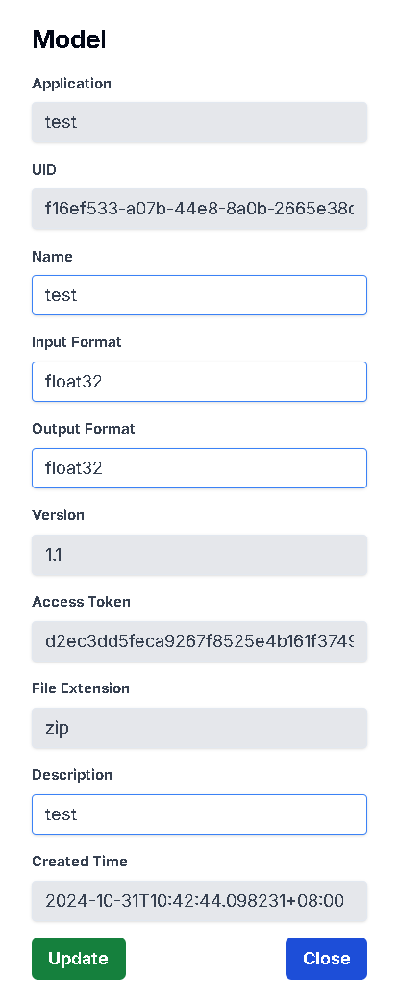

# 查看所有Model

## 用途

查看你的 Application 內的所有 Model 資訊

## 操作步驟

1. 在 Application 頁面點擊你的 Application
    
    

2. 進入 Application  Dashboard 頁面後，點擊 Model，即可查看所有 Model

    

# 新增Model

## 用途

為你已經訓練好的Model建立資訊

## 操作步驟
    
1. 點擊Upload Model按鈕
    
    
    
2. 輸入Model名稱、’描述及輸入/出格式後，點擊Select File按鈕，即可上傳你的Model壓縮檔(支援.zip)，上傳完後按下Create按鈕
    
    
    
3. Model創建成功
    
    

# 更新Model

## 用途

更新你的 Model 資訊

## 操作步驟

1. 點擊右方的Edit圖示
    
    

2. 輸入更新的Model資訊後，按下Update按鈕
    
    

3. Model更新成功

    

# 下載Model

## 用途

確認上傳的 Model 檔案正確，以及避免檔案消失

## 操作步驟

1. 點擊右方的Download圖示後，在下載紀錄按下保留檔案，即可下載成功
    
     

# 發佈/取消發佈Model

## 用途

讓訂閱此Application的Agent使用此Model
(註：請先完成上傳Inference)

## 操作步驟

1. 點擊Publish左邊的按鈕切換Publish狀態(預設為未發佈)
    
    

2. Model發佈成功，再點擊一次按鈕即可取消發佈

    

# 刪除Model

## 用途

刪除已不需要的Model資訊

## 操作步驟

1. 點擊右方的Delete圖示
    
    

2. 按下Delete按鈕即可刪除成功
    
    