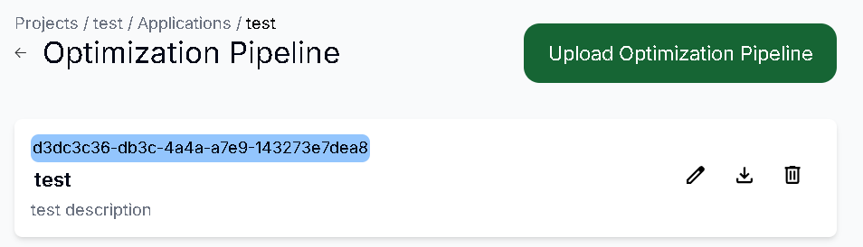
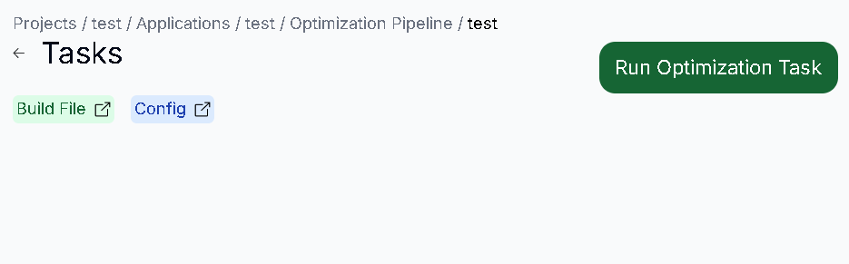
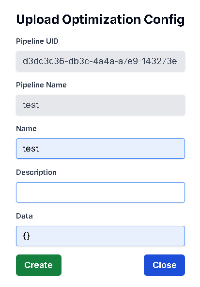
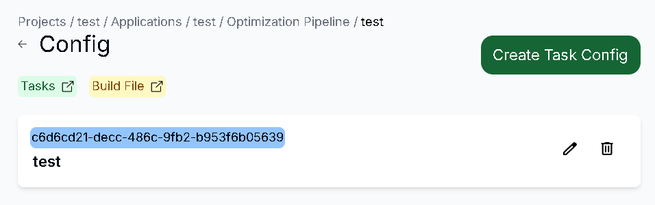
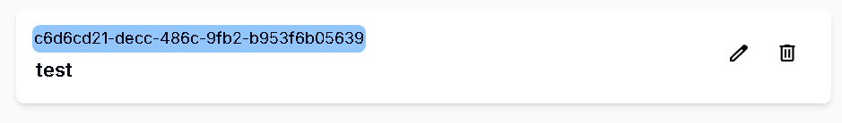
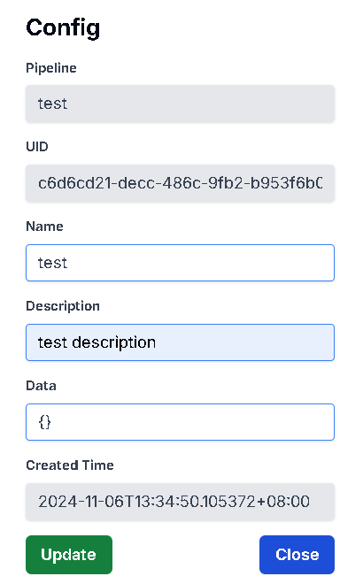
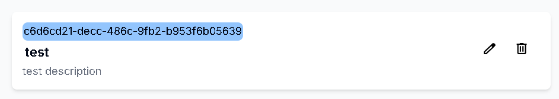

# 查看所有Optimization Config

## 用途

查看你的 Optimization Pipeline 內的所有 Config 資訊

## 操作步驟

1. 進入Optimization Pipeline頁面後，點擊Pipeline
    
    
    
2. 點擊右側的Config按鈕跳轉到Config頁面，即可顯示所有Config
    
    

# 新增Optimization Config

## 用途

為你的 Optimization Config 創建資訊

## 操作步驟
    
1. 按下Create Task Config按鈕
    
    
    
2. 輸入Config資訊(請注意Data須為Json格式)，輸入完成後按下Create按鈕
    
    

3. Optimization Config 創建成功

    

# 更新Optimization Config

## 用途

更新你的 Optimization Config 資訊

## 操作步驟

1. 進入右方的Edit圖示
    
    
    
2. 輸入更新的Config資訊，完成後按下Update按鈕
    
    
    
3. Config更新成功
    
    

# 刪除Optimization Config

## 用途

刪除已不需要的 Optimization Config 資訊

## 操作步驟

1. 進入右方的Delete圖示
    
    
    
2. 按下Delete按鈕即可刪除成功
    
    
    