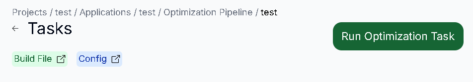
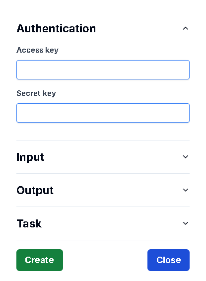
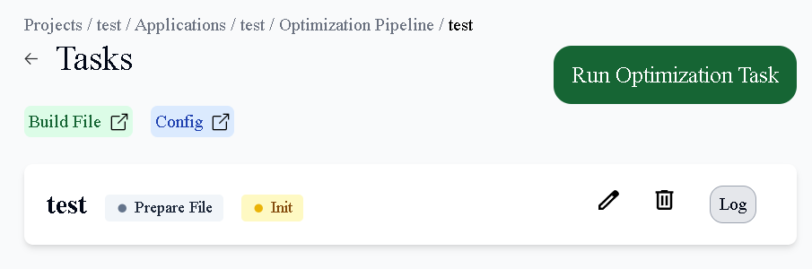
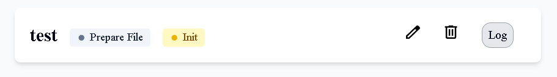
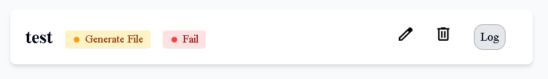
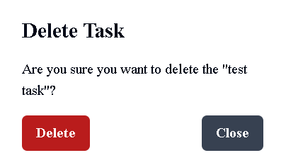

# 查看所有Optimization Task

## 用途

查看你的 Optimization Pipeline 內的所有 Task 資訊

## 操作步驟

1. 進入Optimization Pipeline頁面後，點擊Pipeline，即可顯示所有Task
    
    

# 新增Optimization Task

## 用途

為你的 Optimization Task 創建資訊

## 操作步驟
    
1. 按下Run Optimization Task按鈕
    
    
    
2. 輸入你的 Task資訊，輸入完後按下Create按鈕
   1. Authentication：Access Key為登入帳號、Secret Key為登入密碼
   2. Input：選擇你要Retrain的Dataset、Model、Build File(Image)、Config
   3. Output：輸入訓練完的Model資訊
   4. Task：輸入你的Task資訊
    
    

3. Preprocessing Task 創建成功

    

# 更新Optimization Task

## 用途

更新你的 Optimization Task 資訊

## 操作步驟

1. 點擊右方的Edit圖示
    
    
    
2. 輸入更新的Task資訊，完成後按下Update按鈕
    
    
    
3. Task更新成功
    
    

# 下載Optimization Task Log

## 用途

下載你的 Optimization Task Log 資訊

## 操作步驟

1. 點擊右方的Log按鈕，在下載紀錄按下保留檔案，即可下載成功
    
    
    

# 刪除Optimization Task

## 用途

刪除已不需要的 Optimization Task 資訊

## 操作步驟

1. 點擊右方的Delete圖示 (當task狀態不是Running時出現)
    
    

2. 按下Delete按鈕即可刪除成功

    
