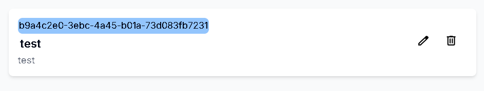

# 新增Preprocessing Config

## 用途

為你的 Preproceesing Config 創建資訊

## 操作步驟

1. 進入Preprocessing Pipeline頁面後，點擊Pipeline
    
    
    
2. 點擊右側的Config按鈕跳轉到Config頁面
    
    
    
3. 按下Create Task Config按鈕
    
    
    
4. 輸入Config資訊(請注意Data須為Json格式)，輸入完成後按下Create按鈕
    
    

5. Preprocessing Config 創建成功

    

# 更新Preprocessing Config

## 用途

更新你的 Preproceesing Config 資訊

## 操作步驟

1. 進入右方的Edit圖示
    
    
    
2. 輸入更新的Config資訊，完成後按下Update按鈕
    
    
    
3. 按下Create Task Config按鈕
    
    

# 刪除Preprocessing Config

## 用途

刪除已不需要的 Preproceesing Config 資訊

## 操作步驟

1. 進入右方的Delete圖示
    
    
    
2. 輸入更新的Config資訊，完成後按下Update按鈕
    
    
    