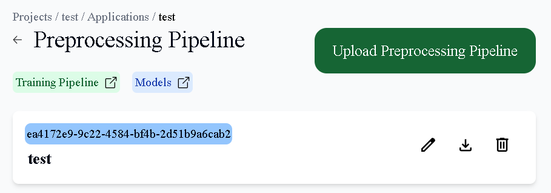
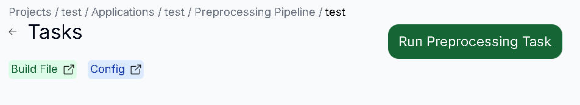
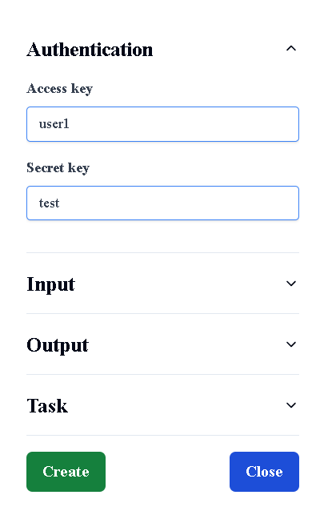
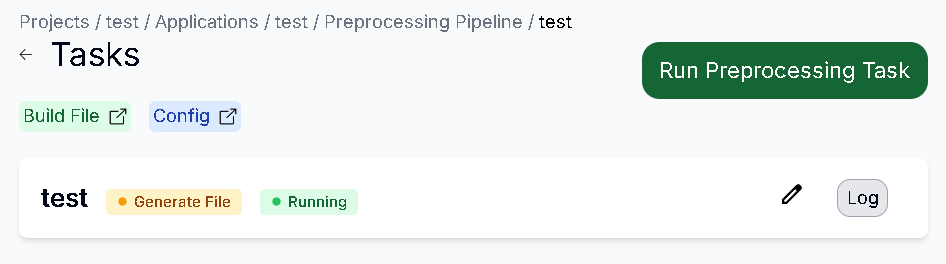
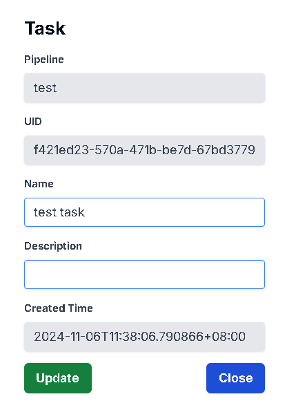

# 新增Preprocessing Task

## 用途

為你的 Preproceesing Task 創建資訊

## 操作步驟

1. 進入Preprocessing Pipeline頁面後，點擊Pipeline
    
    
    
2. 按下Run Preprocessing Task按鈕
    
    
    
3. 輸入你的 Task資訊，輸入完後按下Create按鈕
   1. Authentication：Access Key為登入帳號、Secret Key為登入密碼
   2. Input：選擇你要Preprocessing的Dataset、Build File(Image)、Config
   3. Output：輸入訓練完的Dataset資訊
   4. Task：輸入你的Task資訊
    
    

4. Preprocessing Task 創建成功

    

# 更新Preprocessing Task

## 用途

更新你的 Preproceesing Task 資訊

## 操作步驟

1. 點擊右方的Edit圖示
    
    
    
2. 輸入更新的Task資訊，完成後按下Update按鈕
    
    
    
3. Task更新成功
    
    

# 下載Preprocessing Task Log

## 用途

下載你的 Preproceesing Task Log 資訊

## 操作步驟

1. 點擊右方的Log按鈕，在下載紀錄按下保留檔案，即可下載成功
    
    
    

# 刪除Preprocessing Task

## 用途

刪除已不需要的 Preprocessing Task 資訊

## 操作步驟

1. 點擊右方的Delete圖示 (當task狀態不是Running時出現)
    
    

2. 按下Delete按鈕即可刪除成功

    
