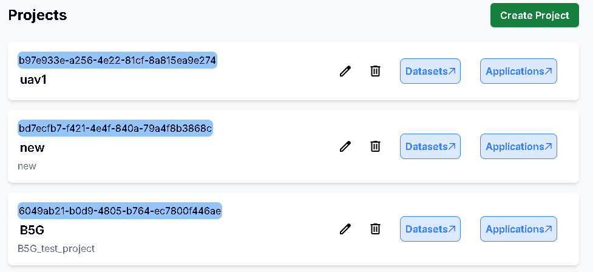
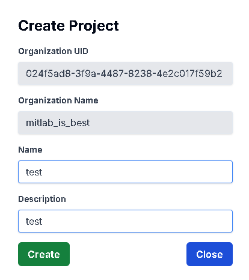
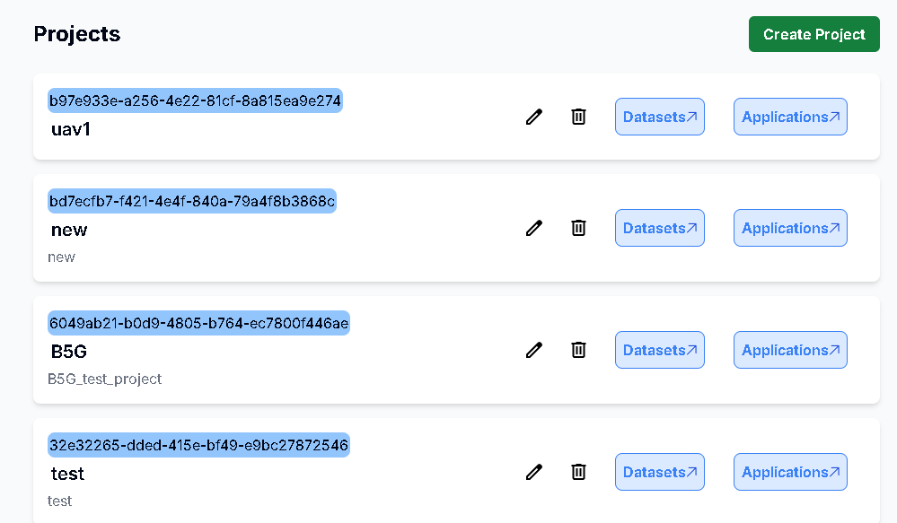
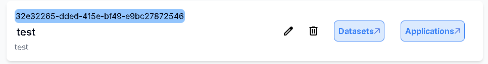
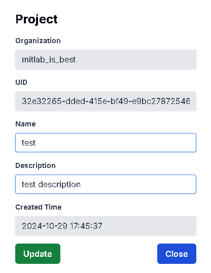

# 新增Project

## 用途

為你的 Project 創建資訊

## 操作步驟

1. 點擊Project頁面右上角的 Create Project 按鈕
    
    
        
2. 輸入Project名稱及描述後按下Create按鈕
        
    
        
3. Project新增成功
        
    

# 更新Project

## 用途

更新你的 Project 資訊

## 操作步驟

1. 點擊右方的Edit圖示
    
    
        
2. 輸入更新的Project資訊後，按下Create按鈕
        
    
        
3. Project更新成功
        
    

# 刪除Projct

## 用途

刪除已不需要的 Project 資訊

## 操作步驟

1. 點擊右方的Delete圖示

    

2. 按下Delete按鈕即可刪除成功
    
    
