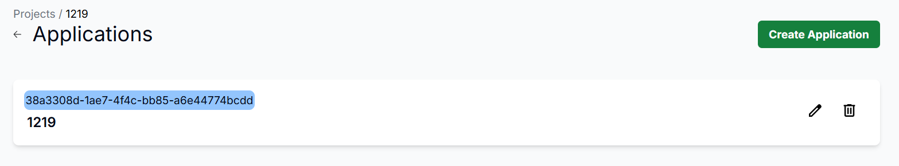
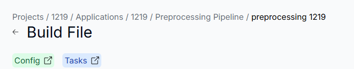

# 整體使用流程
本頁面提供了執行各類任務（包括 Preprocessing、Training、Optimization 以及 Evaluation）的完整操作指引，幫助用戶熟悉從創建專案到執行任務的每一步操作。每個流程皆包含必要的步驟說明與對應的介面截圖，便於快速理解和實踐。

## 如何執行一個 Preprocessing Task

1. **創建Project**

   >在Project頁面點擊Create Project，輸入資訊後即可創建一個Project

    

2. **創建Dataset**
   >這裡的Dataset有分為兩個類別：
   >Original Dataset：進入Dataset頁面，點擊Upload Original Dataset，輸入資訊後即可上傳一個dataset

    

    

   >Optimization Dataset：在Application Dashboard頁面選擇Optimization Dataset，點擊Upload Original Dataset，輸入資訊後即可上傳一個dataset

    

    

3. **創建Applicaiton**
   >回到Project頁面，點擊Application按鈕

    

   >在Application頁面點擊Create Application，輸入資訊後即可創建一個Application
   
    

4. **創建Preprocessing Pipeline**
   >在Application Dashboard頁面點擊Preprocessing Pipeline

    

   >在Preprocessing Pipeline頁面點擊Create Pipeline，輸入資訊後即可創建一個Pipeline

    

5. **創建Preprocessing Config**
   >點擊Pipeline後進入Pipeline頁面，點擊Config按鈕

    

   >點擊Create Task Config，輸入資訊後即可創建一個Config

    

6.  **創建Preprocessing Image**
    >點擊Build File按鈕

    

    >點擊Upload Build File，分別輸入三個Image資訊後，即可創建完run task所需的所有Image

    

7.  **創建Preprocessing Task**
    >點擊Tasks按鈕

    

    >點擊Run Preprocessing Task按鈕，選擇要執行的Dataset Type、Dataset、Image、Config，及其他資訊後，按下Create按鈕

    

## 如何執行一個Training Task

1. **創建Project**
    >在Project頁面點擊Create Project，輸入資訊後即可創建一個Project

    

2. **創建Dataset**
    >進入Dataset頁面，點擊Training Datasets，再點擊Upload Training Dataset按鈕，輸入資訊後即可上傳一個dataset

    

3. **創建Applicaiton**
   >回到Project頁面，點擊Application按鈕

    

   >在Application頁面點擊Create Application，輸入資訊後即可創建一個Application
   
    

4. **創建Training Pipeline**
   >在Application Dashboard頁面點擊Training Pipeline

    

   >在Preprocessing Pipeline頁面點擊Create Pipeline，輸入資訊後即可創建一個Pipeline

    

5. **創建Training Config**
    >點擊Pipeline後進入Pipeline頁面，點擊Config按鈕

    

   >點擊Create Task Config，輸入資訊後即可創建一個Config

    

6. **創建Training Image**
    >點擊Build File按鈕

    

    >點擊Upload Build File，分別輸入三個Image資訊後，即可創建完run task所需的所有Image

    

7. **創建Training Task**
    >點擊Tasks按鈕

    

    >點擊Run Training Task按鈕，選擇要執行的Dataset、Image、Config，及其他資訊後，按下Create按鈕

    

## 如何執行一個Optimization Task

1. **創建Project**
    >在Project頁面點擊Create Project，輸入資訊後即可創建一個Project

    

2. **創建Applicaiton**
   >回到Project頁面，點擊Application按鈕

    

   >在Application頁面點擊Create Application，輸入資訊後即可創建一個Application
   
    

3. **創建Dataset**
    >進入Application Dashboard頁面，點擊Optimization Datasets

    

    >選取Optimization Datasets，點擊Upload Optimizaion Dataset按鈕，輸入資訊後即可上傳一個dataset

    

4. **創建Model**
    >回到Application Dashboard頁面，點擊Model

    

    >點擊Upload Model，輸入資訊後即可創建一個Model

    

5. **創建Optimization Pipeline**
   >回到Application Dashboard頁面，點擊Optimization Pipeline

    

   >在Preprocessing Pipeline頁面點擊Create Pipeline，輸入資訊後即可創建一個Pipeline

    

6. **創建Optimization Config**
    >點擊Pipeline後進入Pipeline頁面，點擊Config按鈕

    

   >點擊Create Task Config，輸入資訊後即可創建一個Config

    

7. **創建Optimization Image**
    >點擊Build File按鈕

    

    >點擊Upload Build File，分別輸入三個Image資訊後，即可創建完run task所需的所有Image

    

8. **創建Optimization Task**
    >點擊Tasks按鈕

    

    >點擊Run Training Task按鈕，選擇要執行的Dataset、Model、Image、Config，及其他資訊後，按下Create按鈕

    
