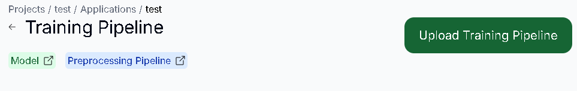
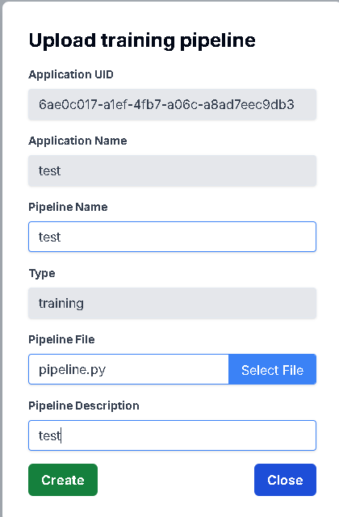
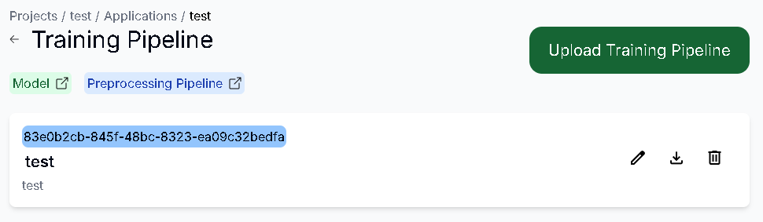
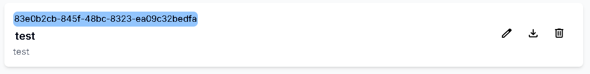
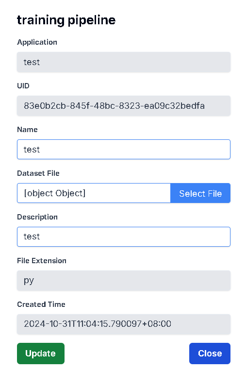
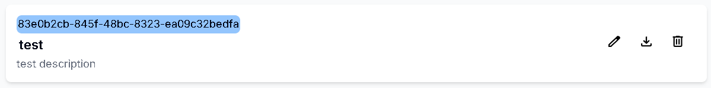
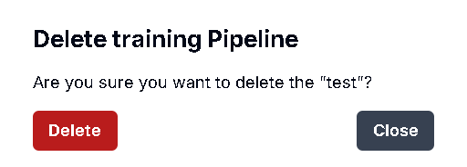

# 新增Training Pipeline

## 用途

為你的 Training Pipeline 創建資訊

## 操作步驟

1. 進入Application  Dashboard頁面後，點擊Training Pipeline
    
    
    
2. 點擊Upload Training Pipeline按鈕
    
    
    
3. 輸入Training Pipeline資訊後，點擊Select File按鈕，即可上傳你的Pipeline檔案，上傳完後按下Create按鈕
    
    
    
4. Training Pipeline創建成功
    
    

# 更新Training Pipeline

## 用途

更新你的 Training Dataset 資訊

## 操作步驟

1. 點擊右方的Edit圖示
    
    

2. 輸入更新的Pipeline資訊，或是按下Select File即可重新上傳檔案。完成後按下Update按鈕
    
    

3. Pipeline更新成功
    
    

# 下載Training Pipeline

## 用途

確認上傳的 Training Pipeline 檔案正確，以及避免檔案消失

## 操作步驟

1. 點擊右方的Download圖示，在下載紀錄按下保留檔案，即可下載成功
    
    

# 刪除Training Pipeline

## 用途

刪除已不需要的 Training Pipeline 資訊

## 操作步驟

1. 點擊右方的Delete圖示
    
    

2. 按下Delete按鈕即可刪除成功
    
    