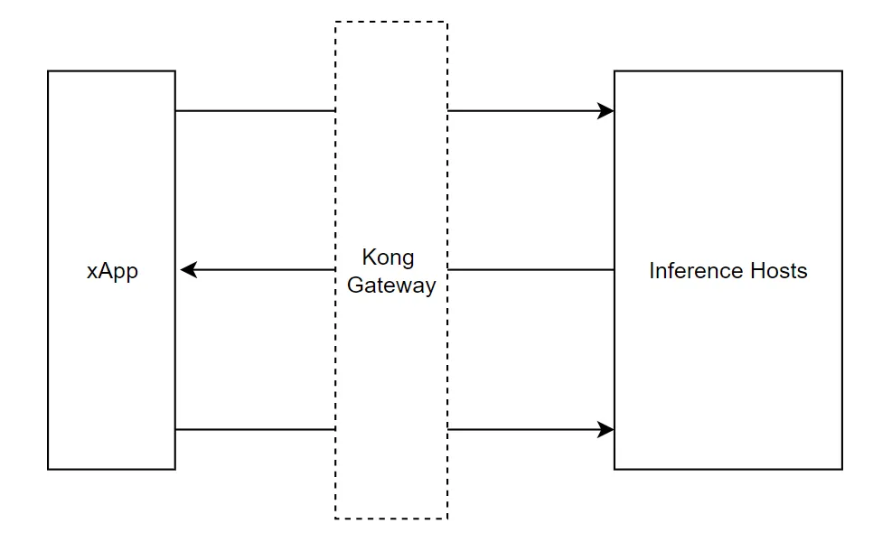

## 什麼是 xApp/rApp？

在O-RAN架構的環境之中，根據O-RAN Alliance的定義，我們將位於Non RT RIC以及Near RT RIC之中的客製化服務系統分別稱之為rApp以及xApp。

(reference: https://accelleran.com/xapp-rapp-2/)

然而MITLab 的AI/ML平台不僅限於5G 6G O-RAN的領域範圍，不論任何意圖，只要是以模型推論作為基本服務的應用，都可以利用AI/ML平台管理其生命週期與優化模型表現，因此在平台之中，我們將所有資料來源待稱為“xApp”。

## 如何使用推論服務

在部署平台中，我們稱數據收集器為 "xApp"。數據將通過 Kong Gateway 向推論主機發送推論請求。xApp 包含的功能有：

1. 數據收集
2. 執行推論任務
3. 推論狀態報告



## 推論服務 Entrypoint

 透過Kong Gateway 的轉發，允許使用者透過API使用平台中的模型推論服務

- API Endpoint
    
    ```
    POST http://<host_ip>:8000/inference-service-<position_uid>
    ```
    
- Request Header
    
    ```json
    {
    	"Content-Type": "application/json"
    }
    ```
    
- Request Body
    
    ```json
    // Required payload: 
    // value
    
    {
      "value": "any_type_of_raw_data"
    }
    ```
    
- Example CURL Request
    
    ```bash
    curl --request POST \
      --url http://<host_ip>:8000/inference-service-<position_uid> \
      --header 'Content-Type: application/json' \
      --data '{
      "value": "any_type_of_raw_data"
    }'
    ```
    
- Response
    - 200 OK
        
        ```json
        {
          "status": "success",
          "value": "<inferenc_result>"
        }
        ```
        
    - 400 ERROR
        
        ```json
        {
          "status": "error",
          "message": "Missing 'value' key in request data"
        }
        ```
        
        ```json
        {
          "status": "error",
          "message": "Invalid JSON in request body"
        }
        ```
        
    - 422 ERROR
        
        ```json
        {
          "status": "error",
          "message": "<message_from_model>"
        }
        ```
        
    - 500 ERROR
        
        ```json
        {
          "status": "error",
          "value": "An unexpected error occurred"
        }
        ```